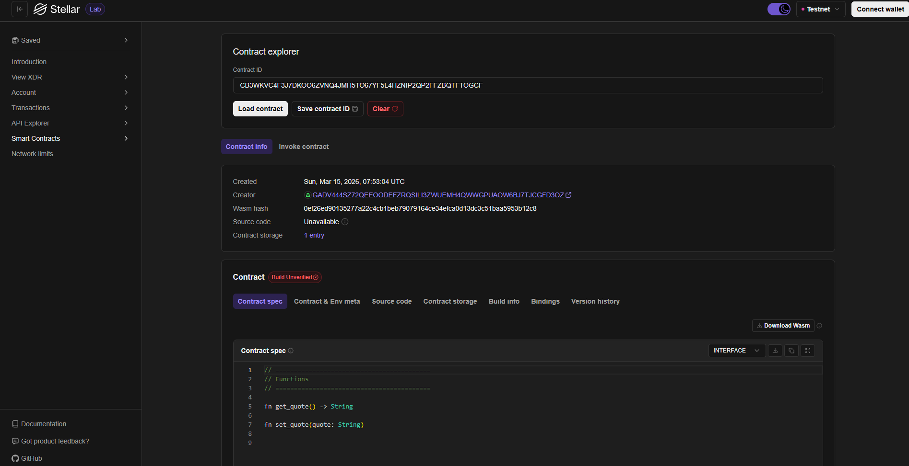

Daily Quote – Soroban Smart Contract

Project Description

Daily Quote is a simple Soroban smart contract built on the Stellar blockchain that allows users to store and retrieve a motivational quote of the day. The project demonstrates how decentralized applications (dApps) can be built using Soroban and Rust.

The contract stores quotes directly on-chain, ensuring transparency and accessibility. This project is designed as a beginner-friendly example to understand smart contract development on Stellar.

---

What It Does

The Daily Quote smart contract allows users to interact with the blockchain to manage a quote of the day.

Users can:

- Store a motivational quote on the blockchain
- Retrieve the currently stored quote
- Interact with the contract through Soroban functions

This demonstrates how Soroban smart contracts can be used for simple decentralized data storage applications.

---

Features

- Built using Soroban SDK
- Written in Rust
- Deployed on the Stellar blockchain
- Stores quotes securely on-chain
- Simple and beginner-friendly smart contract logic
- Demonstrates Soroban instance storage usage

---

Technology Stack

- Rust
- Soroban SDK
- Stellar Blockchain
- Soroban CLI

---

Smart Contract Functions

set_quote()

Stores a new daily quote in the blockchain storage.

get_quote()

Retrieves the currently stored daily quote.

---

How It Works

1. The smart contract is written in Rust using the Soroban SDK.
2. It is compiled into WebAssembly (WASM).
3. The contract is deployed to the Stellar network.
4. Users interact with the contract to store or retrieve quotes.

---

Deployed Smart Contract Link

`https://lab.stellar.org/smart-contracts/contract-explorer?$=network$id=testnet&label=Testnet&horizonUrl=https:////horizon-testnet.stellar.org&rpcUrl=https:////soroban-testnet.stellar.org&passphrase=Test%20SDF%20Network%20/;%20September%202015;&smartContracts$explorer$contractId=CB3WKVC4F3J7DKOO6ZVNQ4JMH5TO67YF5L4HZNIP2QP2FFZBQTFTOGCF;;`

---

Future Improvements

- Allow multiple quotes
- Random quote generator
- User-submitted quotes
- Frontend web interface for easier interaction

---

Author

Soroban Smart Contract Project – Daily Quote